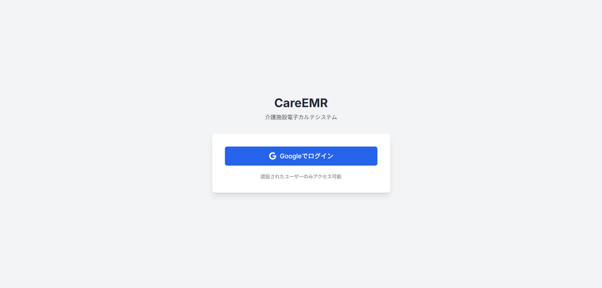
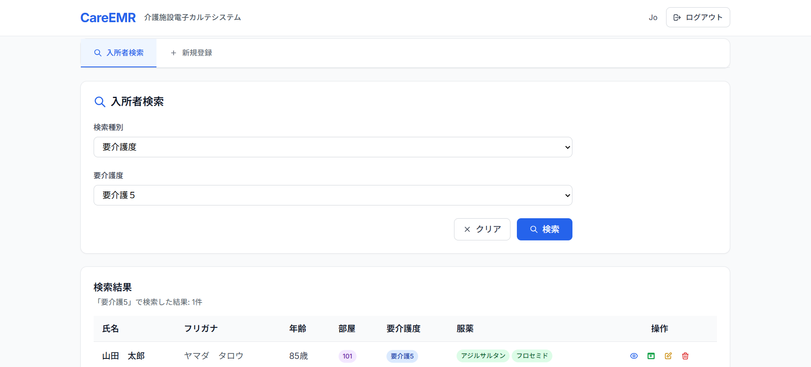
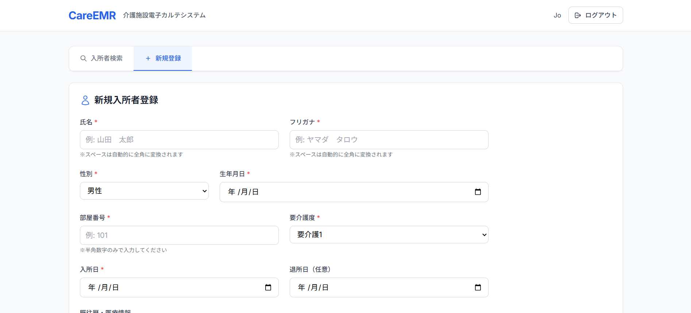
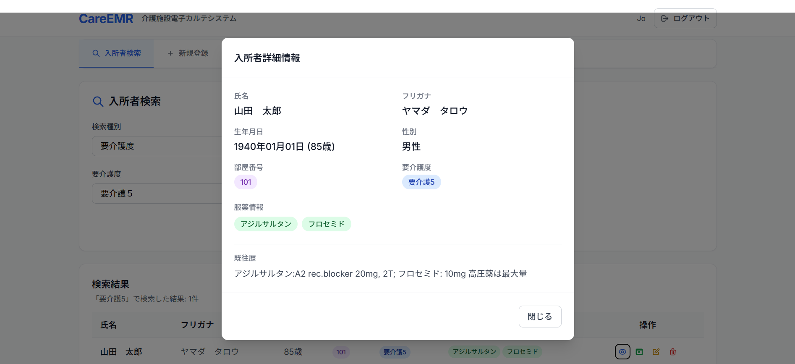
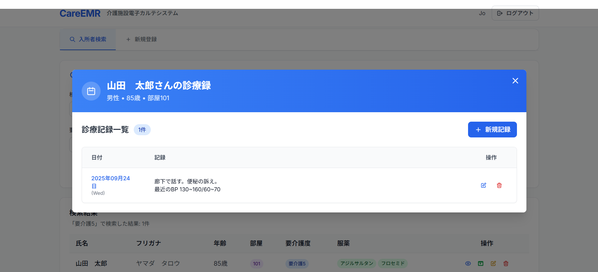

# CareEMR - 介護施設電子カルテシステム

[](https://reactjs.org/)
[](https://www.typescriptlang.org/)
[](https://firebase.google.com/)
[](https://vitejs.dev/)

介護施設向けの現代的な電子カルテシステムです。入所者の情報管理、日次診療録の記録、検索機能を提供します。

## 📸 スクリーンショット

### ログイン画面


### ダッシュボード・検索画面


### 入所者登録フォーム


### 入所者詳細


### 診療録


## ✨ 主な機能

- **入所者管理**: 個人情報、部屋割り当て、介護度（1-5）、服薬情報、病歴の管理
- **日次診療録**: 各入所者の日常的なケア記録と医療情報の記録
- **高度検索**: 氏名、ふりがな、部屋番号、介護度、服薬情報による柔軟な検索
- **セキュアな認証**: Firebase Auth + カスタムクレームによる管理者限定アクセス
- **レスポンシブデザイン**: iPad等のタブレット端末対応
- **日本語対応**: 完全な日本語UI、ひらがな・カタカナ検索サポート

## 🏗️ アーキテクチャ

### フロントエンド
- **React 19** + **TypeScript** - モダンなReact開発
- **Vite** - 高速な開発サーバーとビルドツール
- **Tailwind CSS** - ユーティリティファーストのCSS
- **React Hook Form** + **Yup** - 型安全なフォーム管理と検証
- **Day.js** - 軽量な日付処理ライブラリ（日本語ロケール対応）

### バックエンド
- **Firebase Authentication** - セキュアなユーザー認証（Googleサインイン）
- **Firestore Database** - NoSQLデータベース
- **Firebase App Hosting** - 本番環境ホスティング

### データモデル
- **Residents コレクション**: 入所者の基本情報とケアデータ
- **MedicalRecords コレクション**: 入所者にリンクされた日次診療録

## 🚀 クイックスタート

### 前提条件

- Node.js 18.0.0 以上
- npm または yarn
- Firebase プロジェクトの設定

### インストール

1. リポジトリをクローン
```bash
git clone <repository-url>
cd emr
```

2. 依存関係をインストール
```bash
npm install
```

3. 環境変数を設定
```bash
# 環境ファイルをコピーして編集
cp .env.example .env.development

# Firebase Console から取得した設定値を .env.development に入力
# 本番環境では .env.production を作成
```

**重要**: 環境ファイル（.env.*）にはAPIキーが含まれるため、Gitリポジトリには含まれていません。必ずFirebase Consoleから取得した実際の値を設定してください。

4. 開発サーバーを起動
```bash
npm run dev
```

## 📦 利用可能なスクリプト

### 開発

```bash
# 開発サーバー起動
npm run dev

# 本番ビルド
npm run build

# ビルドをプレビュー
npm run preview

# 静的ファイルを配信
npm run start
```

### コード品質

```bash
# ESLint実行
npm run lint

# TypeScript型チェック（package.jsonに未定義の場合は手動で実行）
npx tsc --noEmit
```

### データ管理

```bash
# テストデータ作成
npm run create-test-data

# 新規管理者ユーザー作成（管理者のみローカル実行）
# 注意: scripts/admin/ は .gitignore で除外されています
npm run admin:create-user <email> <displayName>

# 既存ユーザーに管理者権限付与（管理者のみローカル実行）
npm run admin:set-admin <email>
```

## 🛠️ 開発環境セットアップ

### Firebase設定

1. Firebase コンソールでプロジェクトを作成
2. Authentication で Google サインインを有効化
3. Firestore データベースを作成
4. 環境変数ファイルに設定情報を記入

### 管理者セットアップ

**注意**: 管理者スクリプトはセキュリティ上の理由で、パブリックリポジトリから除外されています。

管理者権限が必要な場合は：
1. Firebase コンソールから直接ユーザー管理
2. Firebase CLI を使用
3. 別途プライベートな管理スクリプトを作成

## 🔐 セキュリティ

- **認証**: Firebase Auth + カスタムクレームで管理者のみアクセス可能
- **認可**: Firestore セキュリティルールで管理者クレーム検証
- **データ保護**: 新規ユーザー登録は無効化、管理者による事前プロビジョニング必須

## 🌏 国際化

- 完全な日本語UI
- 日本語の氏名・ふりがな検索サポート
- ひらがな・カタカナ自動変換機能
- Day.js日本語ロケール設定

## 📁 プロジェクト構造

```
emr/
├── src/
│   ├── components/          # Reactコンポーネント
│   │   ├── SearchPanel.tsx  # メイン検索インターフェース
│   │   ├── ResidentForm.tsx # 入所者登録フォーム
│   │   └── ResidentDetail.tsx # 入所者詳細・診療録
│   ├── contexts/           # React Context
│   │   └── AuthContext.tsx # 認証状態管理
│   ├── services/           # ビジネスロジック
│   │   └── firestore.ts    # データベース操作
│   ├── types/              # TypeScript型定義
│   │   └── index.ts        # メインの型定義
│   └── utils/              # ユーティリティ関数
├── scripts/
│   ├── admin/              # 管理者管理スクリプト
│   └── createTestData.js   # テストデータ生成
├── public/                 # 静的アセット
└── docs/                   # ドキュメント
```

## 🤝 コントリビューション

1. このリポジトリをフォーク
2. 機能ブランチを作成 (`git checkout -b feature/amazing-feature`)
3. 変更をコミット (`git commit -m 'Add amazing feature'`)
4. ブランチにプッシュ (`git push origin feature/amazing-feature`)
5. Pull Request を作成

## 📄 ライセンス

© 2025 Jo Takahashi. All rights reserved.

このソフトウェアは著作権により保護されています。

## 🆘 サポート

質問やサポートが必要な場合は、Issues を作成してください。

---

**注意**: このシステムは介護施設の機密データを扱います。セキュリティベストプラクティスに従い、本番環境では適切な権限管理を行ってください。